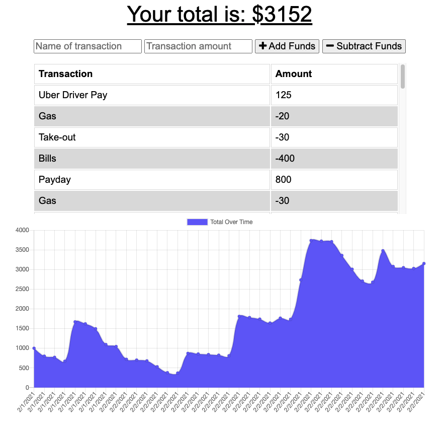

# Fitness Tracker

## Description

This app is meant to serve as a budget tracker. It allows the user to add and subtract funds and give each transaction a name correlate with the transaction. The nice thing about this app is that it is a progressive web application, which means that the app is fully functional offline and it will link back to the app once an internet connection has been re-established.

## Table of Contents 

* [Installation](#installation)

* [Usage](#usage)

* [License](#license)

* [Contributing](#contributing)

* [Tests](#tests)

* [Questions](#questions)

* [Screenshots](#screenshots)

* [Demo](#demo)

## Installation

To install necessary dependencies, run the following command:

`
npm i
`

## Usage

In order to run this app on your local computer, you will need to install the dependencies. You will need to have MongoDB set up (you can go [here](https://docs.mongodb.com/mongocli/stable/install) for step by step instructions to install it on your local machine). Then you will just run `npm start` and the app will run on the localhost: 3000.

## License

This project is licensed under GPL-3.0.
  
## Contributing

Anyone.

## Tests

To run tests, run the following command:

`
n/a
`

## Questions

If you have any questions about the repo,please contact me at drfrank22@gmail.com.

## Screenshots

## Demo

